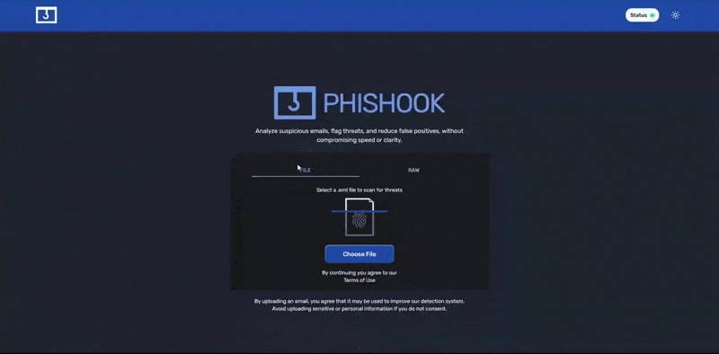
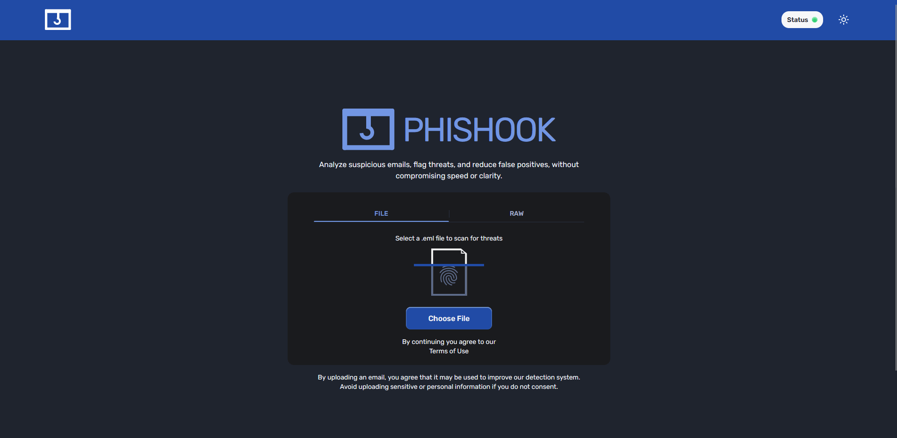
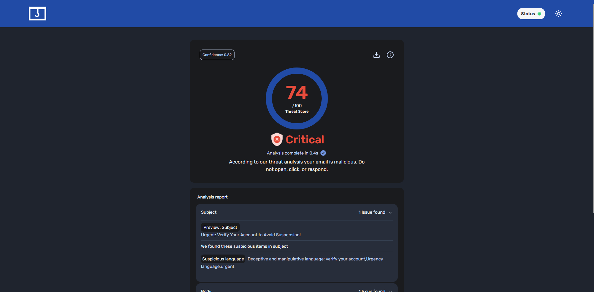
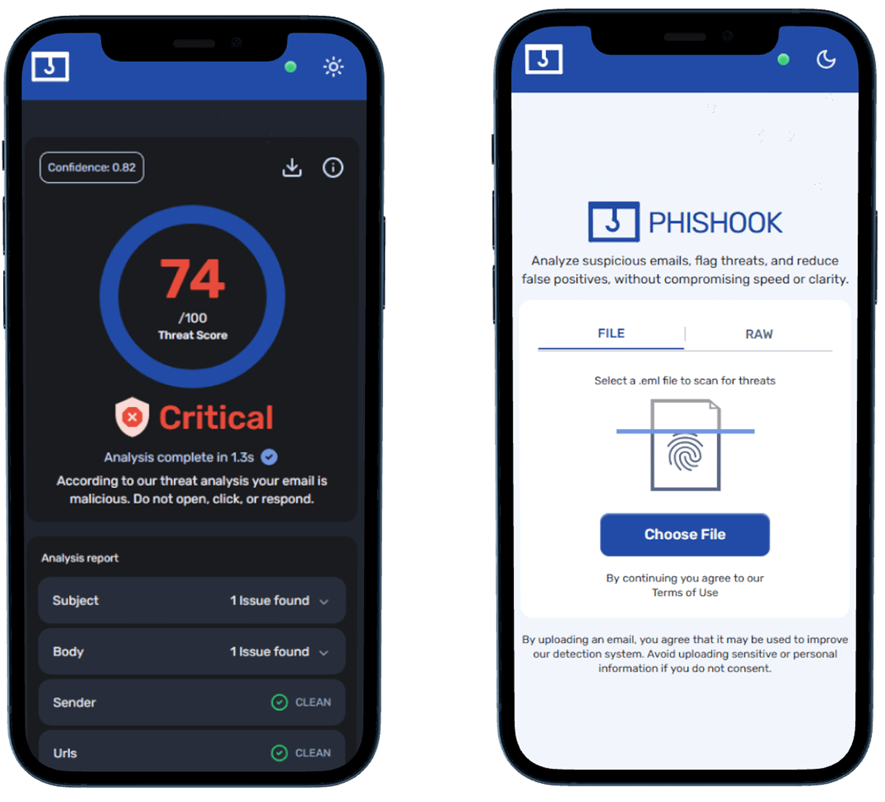

<p align="center"></p>

<div align="center"><h1>Phishook - Phishing Email Detection</h1></div>

<p align="center">
  
  
  
  
  
  
</p>

A lightweight phishing email detection system using rule filters and ML techniques. Users can upload an email and receive an instant analysis using 🔗 [Phishook Detection](https://github.com/thesevenn/phishook-api.git) API built with Python + FastAPI.



👉 Try it yourself at - 🔗 [**Phishook Web**](https://phishook.netlify.app). Just upload an email file and get instant analysis with visual verdicts.

[](https://app.netlify.com/projects/phishook/deploys)

## 📌 Description

Phishook applies a **layered, sequential approach** to detect phishing emails while minimizing latency and compute cost:

- **Rule-based filters** serve as a fast, deterministic pre-check using heuristics (e.g., suspicious URLs, brand impersonation keywords).
- If confidence is low, the email is escalated to the **ML layer**, which refines the score but does **not override** the rule-based result — only adjusts it marginally based on ML confidence.

This hybrid pipeline enables faster results for obvious cases while preserving accuracy for edge cases.

👉 Backend repo: [Phishook Detection API](https://github.com/thesevenn/phishook-api.git)

## ℹ️ Project Information

This system is a _Proof of Concept_ built as part of a capstone project titled **Hybrid Sequential Approach Towards Email Phishing Detection using Rule based and Machine learning Techniques.**

<!-- 👉 Read the paper [here.](https://github.com/thesevenn/phishook-web.git/report.pdf) -->

## 📷 Screenshots

1. Upload page - Desktop view
   

1. Verdict page (Critical) - Desktop view
   

1. Mobile view - Dark Mode, Light Mode
   

## 🪧 Features

- Near Real-time response time (avg. 400ms)
- Instant feedback with Rules triggered
- Zero knowledge detection system
- No user data is stored on server once processed

## 📊 Metrics

### 🎯 Accuracy

- Overall system accuracy: 93.6% (_combined Rule Filters + ML inference_)
- Rule-based filter accuracy: 91.7% (_Assuming uncertain cases are treated as incorrect_)
- ML model accuracy:
  - Email classifier: 99.9% (_trained and tested on a dataset of 40,000 emails_)
  - URL classifier: 91.3% (_trained and tested on 11,000+ URLs_)

### ✅ Performance Metrics

- Average response time: ~600ms (_on 0.1 CPU Render free tier_)
- Worst-case response time: ~1 minute (_due to cold server starts_)
- Average analysis time (Rule + ML): 30ms
- Average ML inference time: 15ms (_Email + URL classifiers combined_)

> [!Note]
> Response time can vary depending on server cold starts and [Render](https://render.com/pricing) tier limitations.

## 🪫 Limitations

- Minimal server resources → possible delays
- No WHOIS lookup (skipped for speed)
- Attachments not analyzed (project scope and resource limitation)
- No model feedback or continual learning loop
- No database or caching layer
- Brand filters may over-trigger on generic terms (e.g., “Inc”, “Group”)

## 📦 Dataset & Model Notes

The ML models were trained primarily on:

- Common phishing formats (e.g., fake receipts, order spam)
- Legitimate marketing/newsletter content

⚠️ **Caveats**:

- Public datasets are biased toward newsletters due to privacy _(More on it later)_.
- HTML-heavy, business-style emails with multiple links are harder to classify accurately.
- Impersonation of known brands (Amazon, PayPal) is well-detected; generic phrasing less so.

**Dataset Bias**: Most publicly available email datasets don’t reflect a typical inbox. Since emails are inherently private, the few datasets available tend to overrepresent newsletters — the only type commonly shared without privacy concerns.

## ⚙️ Technologies Used

- React + TypeScript
- Tailwind CSS
- Shadcn UI
- Vite
- React Router
- React Query

### Backend

- Python + FastAPI
- Machine Learning (custom email + URL classifiers)
- Pandas, NumPy

## 🔭 Roadmap

- Add user feedback loop to improve models
- Analyze attachments (e.g. `.zip`, `.pdf`)
- Verbose rule filter output
- Add WHOIS-based URL checks (cached)
- Add endpoints for: `rule-only` and `ML-only` modes

## ⬇️ Installation and Setup

### Prerequisites

- NodeJS - [Install NodeJS](https://nodejs.org/en)
- Python - [Install Python](https://www.python.org/downloads/)
- Git (Optional) - [Install Git](https://git-scm.com/downloads)
- Pnpm or npm (To run the React webapp)

To install the web application locally, follow the steps.
The React application was bootstrapped using VITE and pnpm.

```bash
git clone repo
cd ./repo
pnpm install
# or
npm install
```

To run the application locally -

```bash
pnpm run dev
# or
npm run dev
```

Visit the app at [http://localhost:5173](http://localhost:5173)

## 📢 Disclaimer

This project is not an enterprise-grade detection system. It’s an academic proof of concept based on known phishing patterns and lightweight models. No system is perfect — always verify suspicious emails manually.

## 🖊️ Author

**Aditya Raj Tripathi** _(Sevenn)_

- Connect with me on [LinkedIn](https://linkedin.com/in/adityart)
- Checkout other projects at [GitHub](https://github.com)

## 📝 License

This project is licensed under the **Creative Commons Attribution-NonCommercial 4.0 International (CC BY-NC 4.0)** license.

You're free to:

- Share — copy and redistribute the material in any medium or format
- Adapt — improve, transform, and build upon the material

**Under the following terms**:

- **Attribution** — You must give appropriate credit.
- **NonCommercial** — You may not use the material for commercial purposes.
- **No Brand Misuse** — The name “Phishook” may not be used to endorse or promote derived works.

📄 [Read full license here](https://creativecommons.org/licenses/by-nc/4.0/)
